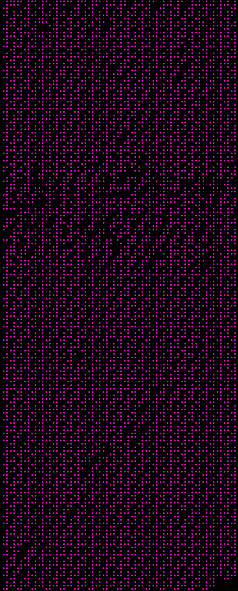

Help a friend reading brailles in an images using CNN model.

<!-- .element height="10%" width="10%" -->
Dataset:
https://www.kaggle.com/shanks0465/braille-character-dataset

Result:
7f454c4602010100000000000000000002003e000100000080004000000000004000000000000000e0000000000000000000000040003800010040000400030001000000070000008000000000000000800040000000000080004000000000004900000000000000490000000000000010000000000000000000000000000000b801000000bf01000000beb400400031c9678b140e83c2316789140effc183f91575eeba150000000f05b83c00000031ff0f0500261f184a3b034200470a0042032e0432414431044c002e7368737472746162002e74657874002e6461746100000000000000000000000000000000000000000000000000000000000000000000000000000000000000000000000000000000000000000000000000000000000b00000001000000070000000000000080004000000000008000000000000000330000000000000000000000000000001000000000000000000000000000000011000000010000000300000000000000b400400000000000b4000000000000001500000000000000000000000000000004000000000000000000000000000000010000000300000000000000000000000000000000000000c9000000000000001700000000000000000000000000000001000000000000000000000000000000

Conclusion:
It's the hexacode of an ELF file.

Problems arised while training:

1) The dataset doesn't have the number mark. After trying on some examples, I found out that the model predicted it as letter 'Y', so if an 'Y' appears before a letter from 'A' to 'I', i will interprete it as number from 0 to 9 respectively. It seems inaccurate if it's actually an 'Y' but works well in this case.

2) Each characters in the image is not equally divided. Therefore, I have to adjust first few characters in each line to make the model predict accurate.

3) Starting a new session will affect the result. The first day, I trained the model and it predicted relatively accurate. But the day after, I trained again with the same model and the result I got is completely different. After that, I tried restarting session and it worked like the first day.
